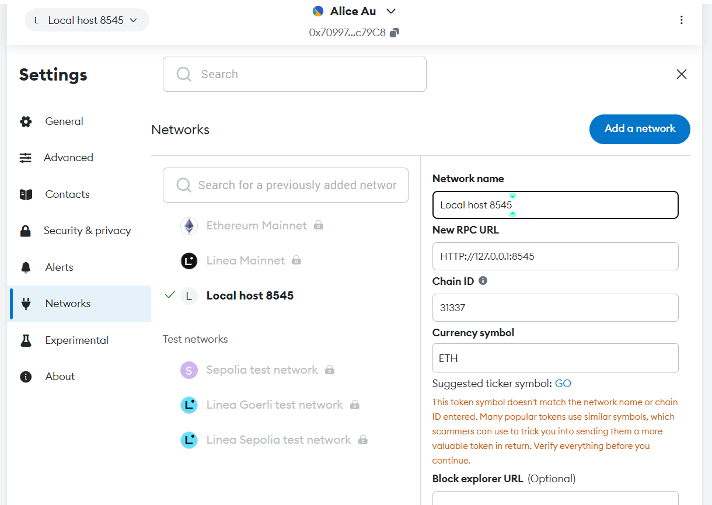

## Frontend

The frontend file in .\cv-exchange contains code building up the user interface, including

1. a sign-in/sign-up page
2. Interface for candidates
3. Interface for hiring companies

```
cd cv-exchange
```

&nbsp;
For the first time setting up the project
```
npm install
```
&nbsp;
To start this react project and run our localhost:3000
```
npm start
```


## Backend

The backend file in .\backend contains code building up APIs that connect with the MongoDB database. The code is written in nodejs. The node version I am using is v20.3.0

```
cd backend
```

&nbsp;
For the first time setting up the project
```
npm install
```
&nbsp;
To start this nodejs project and run our localhost:5000
```
node server.js
```


## The blockchain

Setting up this locally run blockchain aims to simulate the real ETH blockchain environment.

```
cd blockchain
```

&nbsp;
For the first time setting up the project
```
npm install
```

&nbsp;
Run the following to start the blockchain node running at localhost:8545. It also provides you dummy private keys and blockchain transaction records mined locally. 
```
npx hardhat node
```
&nbsp;
Connect your metamask with Chrome and localhost:8545
1. Add Metamask extension at https://chromewebstore.google.com/detail/metamask/nkbihfbeogaeaoehlefnkodbefgpgknn?hl=en
2. Login to your Metamask account. Create one if you don't have it.
3. Add a network of local host 8545.


&nbsp;
Adding testing address to Metamask
1. Click on the arrow to the right of "Alice Au"\

2. Click on "Add account or hardware wallet" -> "Import an account"
3. Enter a private key. You may choose to use the ones from your blockchain node command
4. Go ahead with any transaction in the web application
